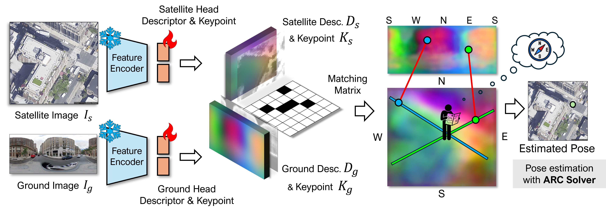
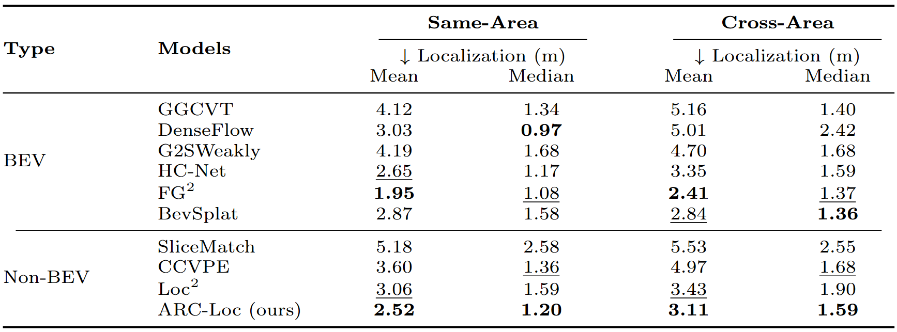

# ARC-Loc: Leveragine Azimuthal Ray Convergence as a Geometric Cue for Direct Cross-View Localization
<br>
<p align="center">  </p>

## 📝 Abstract
Cross-view localization (CVL) estimates the pose of a ground image by matching it to a geo-referenced satellite image. 
To bridge the extreme viewpoint gap, mainstream pipelines rely on Bird's-Eye-View (BEV) transformations or 2D-to-3D lifting. 
However, deriving 3D structures from a single ground image is fundamentally ill-posed, causing these methods to endure geometric distortions and computational costs during 3D lifting or BEV projection. Furthermore, relying on external depth foundation models to resolve this introduces latency and remains susceptible to noisy predictions.
In this work, we present a different approach inspired by a human navigation technique called \textit{resection}, that can perform direct ground to satellite image matching and localization without relying on external depth foundation models.
The key insights of our method are that (i) ground keypoints can be translated into azimuthal rays on the satellite map, and (ii) these rays ideally converge at the user location. 
Exploiting this geometric constraint through direct line-to-point correspondences, we introduce a minimal Azimuthal Ray Convergence (ARC) solver to identify the intersection, alongside an ARC loss to optimize the matching network. 
By eliminating dependencies on computationally heavy BEV transformations and external depth foundation models, our approach achieves faster, memory-efficient inference, while its explicit feature matching ensures straightforward compatibility with existing frameworks.
Experiments on VIGOR and KITTI demonstrate that ARC-Loc maintains competitive localization accuracy compared to recent approaches, highlighting its practicality.


## ⚙️ 1. Preparation:
### Requirement:
* PyTorch 2.2.2, python=3.10, cuda=12.1

```
pip install -r requirements.txt
```

### VIGOR Dataset

Download the dataset from the [official VIGOR repository](https://github.com/Jeff-Zilence/VIGOR/blob/main/data/DATASET.md).

**Update the config:**  
In `config.ini`, set `dataset_root` under VIGOR entry to the path where you placed the VIGOR dataset, for example:

dataset_root = /home/username/VIGOR

**Corrected labels (recommended):**  
Download the corrected label splits from [SliceMatch (VIGOR_corrected_labels)](https://github.com/tudelft-iv/SliceMatch/tree/main/VIGOR_corrected_labels), and follow their instructions to replace the original `splits` folder with the downloaded `splits__corrected` folder.

### KITTI Dataset

Download and structure the dataset according to [HighlyAccurate
](https://github.com/YujiaoShi/HighlyAccurate).
In `config.ini`, set `dataset_root` under KITTI entry to the path where you placed the KITTI dataset, for example:

dataset_root = /home/username/KITTI

---

## Inference
```
python main.py ~~~
```

## Training
```
python test.py ~~~
```

## 📊 Results
<p align="center">  </p>


## ☎️ Contact
If you have any questions or issues, please open an issue on GitHub or contact me at [khs06007@hanyang.ac.kr].

## Reference
* This repository is heavily built upon the official implementation of [FG2](https://github.com/vita-epfl/FG2). We sincerely thank the authors for open-sourcing their excellent work.**.

## License
